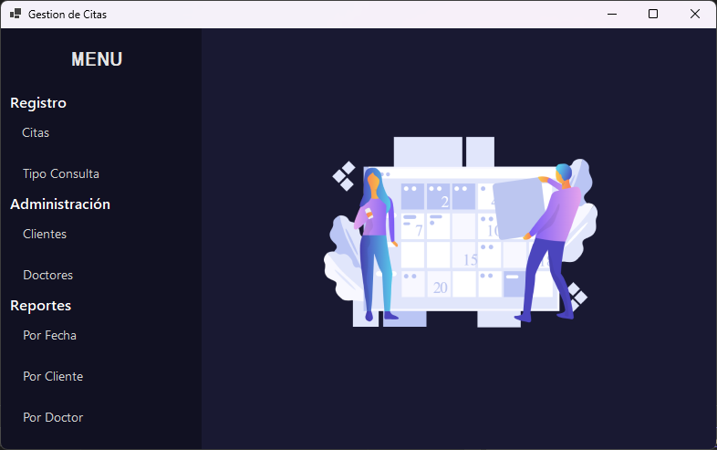

# Desarrollo del Sistema de Administración de Citas Dentales

## Resumen

Este repositorio contiene un proyecto desarrollado en C# utilizando Visual Studio Community 2022, con el objetivo de crear una herramienta de escritorio para la administración de citas de dentistas. El sistema permite gestionar clientes, doctores y citas asignadas a través de una interfaz gráfica de usuario. A continuación, se detallan las funcionalidades principales del sistema:

## Funcionalidades Principales

**Registrar Tipos de Consulta**: Permite al usuario registrar, consultar y modificar los tipos de consultas que se realizan en el consultorio, como extracciones, limpiezas, cirugías, etc.

**Administración de Clientes**: Permite al usuario registrar, consultar y modificar los datos de los clientes que serán atendidos en las citas programadas.

**Administración de Doctores**: Permite al usuario registrar, consultar y modificar los datos de los doctores que brindarán las consultas programadas.

**Registro de Citas**: Permite al usuario programar citas para los clientes con los doctores disponibles, asegurando que no haya duplicación de citas en la misma fecha y hora para un mismo doctor.

**Reporte Citas por Fecha**: Permite al usuario visualizar las citas programadas para una fecha específica, mostrando información relevante de cada cita.

**Reporte Citas por Doctor**: Permite al usuario visualizar las citas programadas para un doctor específico, mostrando información relevante de cada cita.

**Reporte Citas por Cliente**: Permite al usuario visualizar las citas programadas para un cliente específico, mostrando información relevante de cada cita.

## Consideraciones Técnicas

El proyecto sigue las siguientes consideraciones técnicas:

- Uso de comentarios en el código para describir detalles del proyecto, universidad, cuatrimestre, nombre del estudiante y fecha.
- Implementación de Programación Orientada a Objetos (POO) con capas separadas: Capa de Entidades, Capa de Lógica de Negocio y Capa de Presentación (Interfaz de Usuario).
- Utilización de arreglos de objetos en lugar de arreglos de tipos primitivos (string, int) para representar Tipos de Consulta, Clientes, Doctores y Citas.
- Manejo de excepciones para garantizar la estabilidad del sistema y mostrar mensajes de error apropiados.
- Interfaz de usuario basada en formularios GUI para facilitar la interacción del usuario con el sistema.

Este proyecto representa una herramienta esencial para la gestión eficiente de las citas en un consultorio dental, ayudando a mantener un registro organizado de clientes, doctores y citas programadas.
